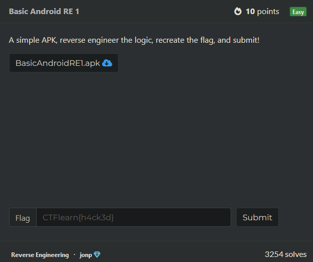
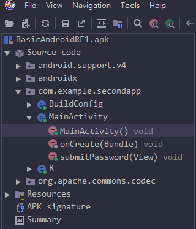
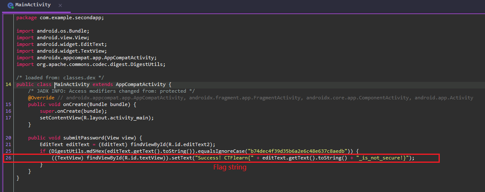
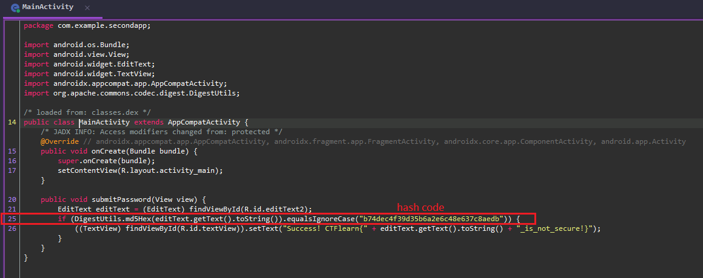
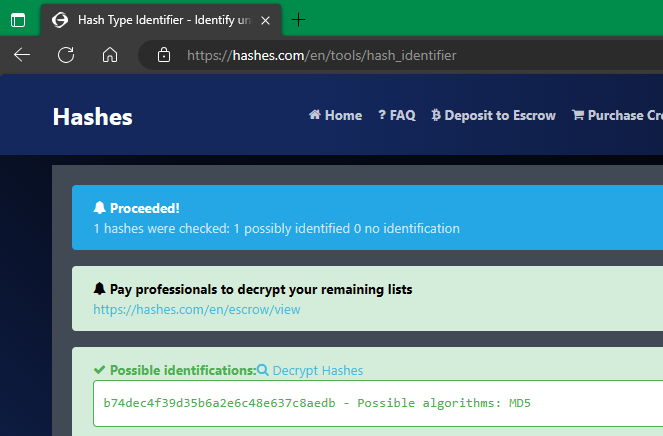
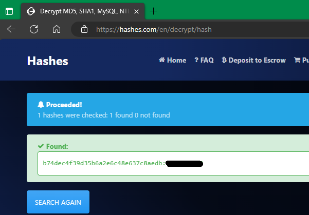
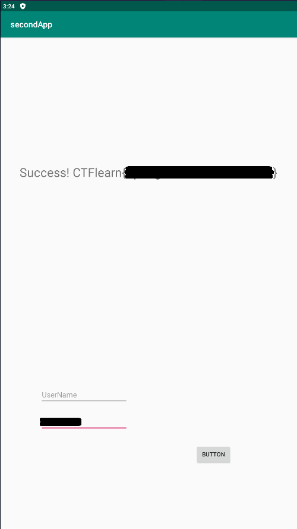

Basic Android RE 1 
 
Link to the Room : https://ctflearn.com/challenge/962

Date Start : 5/11/2023
Date Finish : 5/11/2023

Reviewed any writeup : N/A

Tools :  
[1] BlueStacks - For opening apk  
[2] JADX-GUI - For reversing apk  
[3] https://hashes.com/en/tools/hash_identifier - For identifying the hash  
[4] https://hashes.com/en/decrypt/hash - For decrypting MD5

OS : Windows 10 

Procedure : 
1) Download the apk (and all the Tools if you do not have) 

2) Use Tool [2] and review source code directly into "com.example.secondapp" > "MainActivity" 

3a) You will see Flag string at the bottom  (line 26) <code>((TextView) findViewById(R.id.textView)).setText("Success! CTFlearn{" + editText.getText().toString() + "_is_not_secure!}");</code> 

3b) in upper line you will see hash code (line 25) <code>if (DigestUtils.md5Hex(editText.getText().toString()).equalsIgnoreCase("b74dec4f39d35b6a2e6c48e637c8aedb")) {</code> 

4) use Tools [3] to identfy the hash and find out it is MD5 

5) use Tools [4] to decrypt MD5 code in 3b) 

6) You will get the password 
7) use Tools [1] to open the apk 
8) enter the password and you will get the flag 

