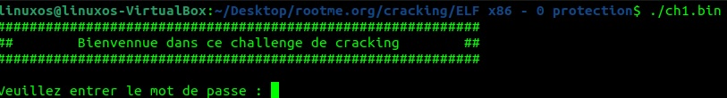
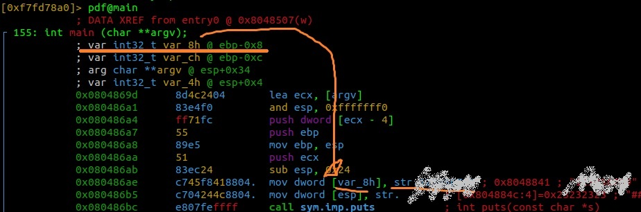
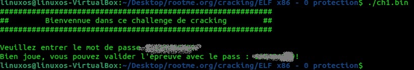

LF x86 - 0 protection
 
Link to the Room : [https://www.root-me.org/en/Challenges/Cracking/ELF-x86-0-protection](https://www.root-me.org/en/Challenges/Cracking/ELF-x86-0-protection)

Date Start : 7/12/2023 Date Finish : 7/12/2023

Reviewed any writeup : N/A

Tools : 
[1] Radare2 - Reversing elf 

OS : Ubuntu

Procedure : 
1) Download the room file ch1.zip (and all the Tools if you do not have) 
2) Extract the zip file and you will get ch1.bin 
3) Open the terminal and run the bin file with ./ch1.bin 
4) You are asked to enter to password 

5) Run Radare2 on your terminal with :  
r2 -dA ch1.bin -> afl -> pdf@main 
You should successfully disassemble the code from a binary 
6. Now you can see the password already stored in plantext at the start in var_8h = str.xxxxxxxxx 

7. Go back and run the bin file again and type the string value xxxxxxxxx 

8. Profit 

