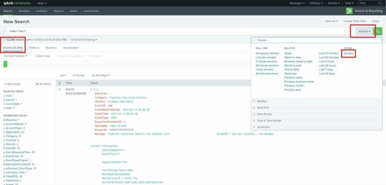
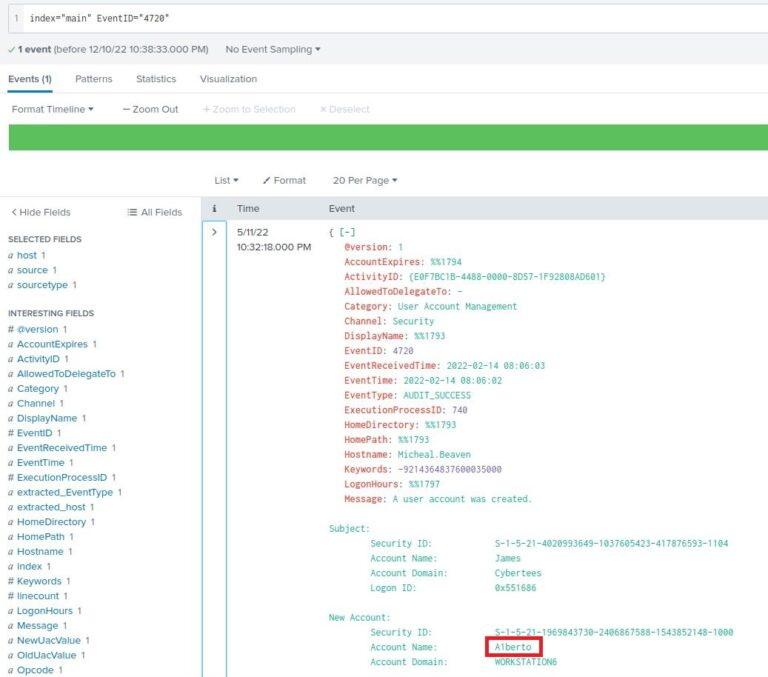
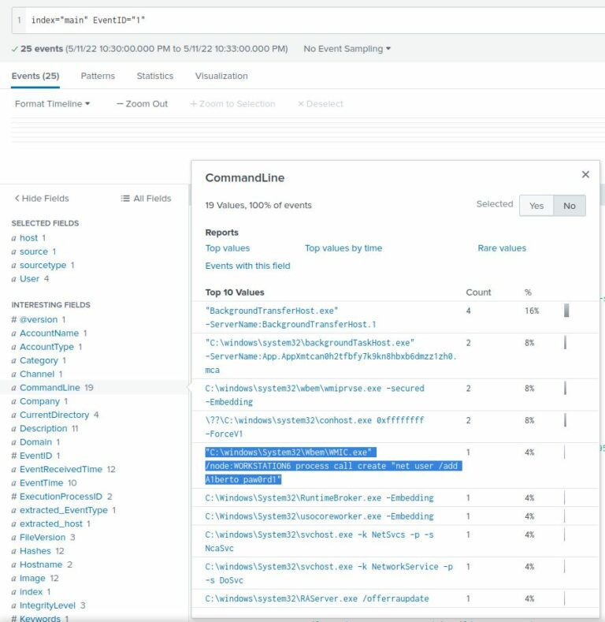
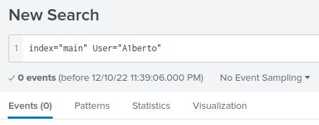
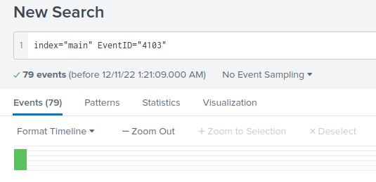
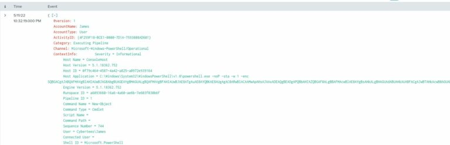
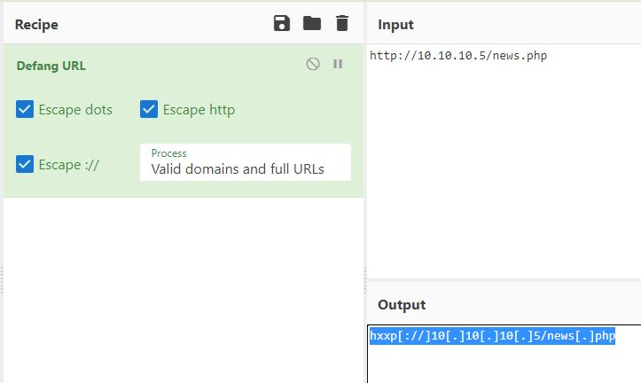

# Investigating with Splunk

## Scenario

In this scenario, we’re receiving a set of logs that contain anomalous behavior from a network of Windows machines. It’s our job to identify those anomalies and answer the related questions posed by the room. All relevant logs are the index “main”.

### Question 1: Total events
<b>“How many events were collected and Ingested in the index main?”</b>

To find the total number of events, we can create a simple search query containing a field:value pair. These pairs will make up the majority of our searches as we progress through the investigation. To start, we’ll use the search (`index="main"`). This will display all the events within the “main” index, where our relevant logs are kept.

Don’t forget to change the timeframe! By default, you’ll only see a fraction (or none) of the events in the index. For this exercise, use “All Time”.



With our time frame set and our first search entered, we can see the total number of events under the search bar – <b>12256</b> events.

### Question 2: Backdoor user
<b>“On one of the infected hosts, the adversary was successful in creating a backdoor user. What is the new username?”</b>

Let’s consider the information we’ll need to answer this question: the new username, and an event in which a user account was created. We know that we’re in a Windows environment, and by examining the “Interesting Fields” pane, we can see that the EventID field is available to us. This means that Windows and/or Sysmon from the Sysinternals suite has done some logging. Both Windows and Sysmon use EventID to store an ID number that correlates to a type of event.

In this case, we want to see events in which a user account was created, which is logged as ID number 4720. We can append a filter for that ID to our search: (`index="main" EventID="4720"`)



There’s only one event returned, and it indicates the account that created the backdoor, James, and the name of the new backdoor account, A1berto. Pay particular attention to the spelling – the “L” is replaced with a “1”, likely in an attempt to appear similar to an already-existing legitimate user.

### Question 3: Registry key
<b>“On the same host, a registry key was also updated regarding the new backdoor user. What is the full path of that registry key?”</b>

Similarly to how we found the event logged when a new user was created, we can find events related to registry updates. The applicable event ID is 13. By altering the event ID from our previous search to 13, we can see all registry updates in the index. However, there are over 1,000 of them, most unrelated to the new backdoor user. To further refine our search, I’ll add the username to the search: (`index="main" EventID="13"`) a1berto


There’s only one event returned and it has the registry path we want:
```
HKLM\SAM\SAM\Domains\Account\Users\Names\A1berto
```

### Question 4: Legitimate user
<b>“Examine the logs and identify the user that the adversary was trying to impersonate.”</b>

We can probably guess the answer to this, but let’s make sure to do our due diligence.

For this question, we don’t need to use a event ID or the backdoor username, so I’ve removed them from the search. We want to view logs from the entire index: index="main".

By selecting the “User” field in the “Interesting fields” pane, we can see one of the most active users is Cybertees\Alberto. The question doesn’t need the domain, only the username: Alberto.


### Question 5: Remote backdoor command
<b>“What is the command used to add a backdoor user from a remote computer?”</b>

Since Windows must run a process to add a new user, and each time a new process is created a log entry is added, there must be another log with a different Event ID containing the command that was executed. This Event ID is #1. By adding that value to our search, we are down to 25 logs: index="main" EventID="1"

To find the command among these 25 logs, we can look back at our “Interesting fields” pane. By clicking on the “CommandLine” field, we can see a list of commands, including the one for which we’re looking:

“C:\windows\System32\Wbem\WMIC.exe” /node:WORKSTATION6 process call create “net user /add A1berto paw0rd1”



### Question 6: Backdoor logins
<b>“How many times was the login attempt from the backdoor user observed during the investigation?”</b>

When a user logs in remotely, Sysmon logs a new network connection with Event ID 3. That log contains the username in the User field. Before even filtering the ID, I’ll add a filter for the backdoor user: (`index="main" User="A1berto"`)



0 results means there were 0 logons from the backdoor account.

### Question 7: Infected host
<b>“What is the name of the infected host on which suspicious Powershell commands were executed?”</b>

By simply searching (`index="main" powershell`) and examining the Hostname field, we can see that only one host has any PowerShell history: James.browne.


### Question 8: Malicious PowerShell
<b>“PowerShell logging is enabled on this device. How many events were logged for the malicious PowerShell execution?”</b>

This question again relies on event IDs. When PowerShell logging is enabled, Windows logs all PowerShell commands with event ID 4103. By searching for events with this ID, we find there were 79 malicious PowerShell commands: (`index="main" EventID="4103"`)



### Question 9: Web request
<b>“An encoded Powershell script from the infected host initiated a web request. What is the full URL?”</b>

From our previous search, we can examine any of the returned logs to find a suspicious looking Base64 string preceded by the command (`C:\Windows\System32\WindowsPowerShell\v1.0\powershell.exe -noP -sta -w 1 -enc`)



To get the answer, we need to decode the Base64 string. To do that, I used the following command in a Linux terminal: (`echo $STRING > base64.txt && base64 --decode base64.txt.`) In the output, there’s some obfuscation going on, but this part is particularly pertinent:
```
$ser=$([TeXT.ENCodiNG]::UnicodE.GetStriNG([CoNVeRT]::FroMBASe64StRInG('aAB0AHQAcAA6AC8ALwAxADAALgAxADAALgAxADAALgA1AA==')));$t='/news.php'
```

As you can see, there’s a second Base64 string in there, so I’ll decode it too by following the same process. Doing so yields the URL (defanging my own) hxxp[://]10[.]10[.]10[.]5.

Later in the obfuscated code, we see (`DowNLoadDatA($SEr+$t)`), which is the actual web request. To get the URL, we combine $SEr and $t. This becomes hxxp[://]10[.]10[.]10[.]5/news[.]php.

I’ve already defanged the URL, but your results will look like a real one. To get the defanged version like I have above, run the URL through CyberChef’s “Defang URL” recipe. It’s required for the final question.


