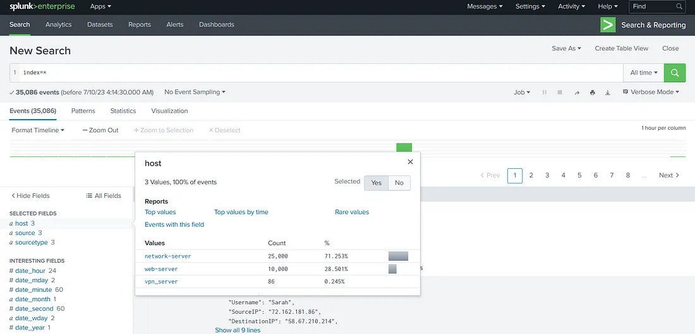

# Splunk: Dashboards and Reports

### Introduction

Splunk is one of the most widely used Security Information and Event Management (SIEM) solutions in the enterprise environment. It helps aggregate data from different data sources in the enterprise environment to help enhance security monitoring. However, sometimes, this data becomes too overwhelming for analysts. In this room, we will learn how an analyst can better organize the data in Splunk. Broadly, we will have the following learning objectives.

### Learning Objectives:

* Why do we need to organize data in Splunk
* Creating dashboards for the visualization of high-level information
* Scheduling reports for recurring searches of data
* Translating Security Operations Center (SOC) use cases to alerts

### Organizing Data in Splunk

Splunk does a great job of aggregating the security-related data of an organization’s assets in a single place. However, this data is huge, difficult to grasp, and make sense of. We will learn how to make sense of the data in this room.

When we open Splunk, this is the screen we might be greeted with after signing in.

To move forward, go to the first tab on the left menu, Search & Reporting. Clicking that, we see the following interface.

Now, we can see that we have an interface for the Search app. For starters, we can start a search with the search term (`index=*`) to see what data we have here. We have set the time window to 'all time' to see the data historically present here as well.

Looking at the above screenshot, we can feel overwhelmed. There are more than 35000 events present in this data. If we are to sift through this data manually, it will make our lives difficult instead of making them easier. Therefore, looking at raw data is often not a good idea when our goal is to get an overview of an organisation’s security posture. It also doesn’t give us much information about the threats and attacks launched against the organization. Now this is just a sample of data in Splunk that we have added for this room. In production, we should avoid running searches for ‘all time’ as they can add undue load on the Splunk search head and make other searches difficult and slow.

The above-mentioned problems are bound to appear when we deal with a lot of data. Splunk is a data analysis platform that provides solutions for these problems. In the coming tasks, we will see how to aggregate and visualize this data to find answers to our problems.

## Question 1 : 
<b>"Which search term will show us results from all indices in Splunk?</b>

> Answer : **`index=*`**

### Creating Reports for Recurring Searches

Until now, we have been using Splunk for broad searches mainly. However, we often need to run specific searches from time to time. For example, a certain organization might want to run a search every 8 hours when a new shift of SOC analysts arrives or is leaving. For this purpose, creating a report that will run at a specific time is efficient. Reports will then run the searches and save the results for viewing when the analysts for the incoming shift arrive.

Reports can also help reduce the load on the Splunk search head. For example, if multiple searches need to be run at the start of every shift, running them simultaneously can increase the search head’s load and processing times. If searches are scheduled with 5 or 10-minute intervals, they will accomplish two tasks.

    * The searches will run automatically without any user interaction.
    * The searches will not run simultaneously, reducing the possibility of errors or inefficiency.

Continuing from the previous task, move to the Reports tab to look at already saved reports in Splunk. We will see the following interface.

Here, we see a list of reports already saved in Splunk. If we want to view the saved results of a report, we can click on the report’s name. However, if we want to run a new search using the same query as the one in a report, we can use the ‘Open in Search’ option. The ‘Edit’ option allows us to edit the reports. The ‘Next Scheduled Time’ tab shows when the report will run again. We can also see the report’s owner and its associated permissions. Please note that we have selected ‘All’ reports to be shown in the view above. There are options for viewing only the logged-in user’s reports, as well as for viewing the reports added by the App.

To create a new report, we can run a search and use the Save As option to save the search as a report.

Once we click the option to Save As Report, we see the following window.

Filling in the required data and clicking the ‘Save’ option here will save the search as a report.

Let’s practice the same in the attached Splunk instance. We ran a search in the previous task. To create a report on a search, we will first have to understand the data. On the left tab, we will see some fields Splunk has identified that might interest us. Let’s click on hosts to see the number of hosts sending logs to our Splunk instance.

So, we have 3 hosts; network-server, web-server, and vpn_server. They are all sending different numbers of events. If we are to determine the number of times each VPN user logged in during our given time window (which is ‘all time’ for this room), we will run the following query.

`host=vpn_server | stats count by Username`

This is what we get when we run this query in our instance.

In a SOC environment, we might want to track users who logged in during a certain time window. This requirement might be repetitive. SOC analysts can create a report for this requirement that will run every few hours for ease of use. Let’s practice that based on what we learned in this task. First, we click ‘Save As’ and select ‘Report’.

We fill in the required information.

Here, we can see the Content for this report will be a ‘Statistics Table’ because we used ‘stats count’ in our query. The ‘Time Range Picker’ has been set to ‘Yes’. This means running the report will give us a time-range picker option. When we click ‘Save’, we get the following prompt, telling us the report has been created.

We can click the ‘View’ option to view our report. This is how it will look.

On the reports tab, we can see our report now.

We see the owner of the report is ‘admin’, the logged-in user. The ‘Sharing’ is set to Private. This means that this report can only be accessed by admin. We can use the ‘Edit’ option to change the permissions and set it to be used by other users.

Create a report from the network-server logs host that lists the ports used in network connections and their count. 

## Question 2 
<b>"What is the highest number of times any port is used in network connections?"</b>

`Use query index=* host=network-server`

> Answer : **5**

## Question 3

While creating reports, which option do we need to enable to get to choose the time range of the report?

> Answer : **Time Range Picker**

### Creating Dashboards for Summarizing Results

Splunk provides us with the ability to create dashboards and visualizations. These dashboards and visualizations provide a user with quick info about the data present in Splunk. Dashboards are often created to help give a brief overview of the most important bits of the data. They are often helpful in presenting data and statistics to the management, such as the number of incidents in a given time frame, or for SOC analysts to figure out where to focus, such as identifying spikes and drops in data sources, which might indicate a surge in, say, failed login attempts. The primary purpose of dashboards is to provide a quick visual overview of the available information.

To move forward, let’s create a dashboard in the attached VM. To start, move to the Dashboards tab. We will see the below screen.

In this screen, we see an option to create dashboards labeled as 1 in the screenshot. Labeled as 2 is a list of available dashboards. Please note that we have selected ‘All’ dashboards here instead of ‘Yours’ or ‘This App’s’, which can show a different list of dashboards. Labeled as 3 is information about these dashboards, such as owner, permissions, etc. Here, we also find the option to Edit the dashboard’s different properties, or set it as the home dashboard. We can also view a dashboard by clicking on the name of the dashboard. However, we don’t have any dashboards yet. We can start by creating a dashboard. For that, let’s click the Create Dashboard option to see the following window.

After filling in the relevant details, such as the name and permissions, we can choose one of the two options for dashboard creation through Classic Dashboards or Dashboard Studio.

We can see that we have set the permissions to ‘Shared in App’. This will ensure that the dashboard is also visible to other users of Splunk. We will use the Classic Dashboard approach to create a dashboard for this room. Let’s do that and click ‘Create’. The Window tells us to ‘Click Add Panel to Start’. When we click the ‘Add Panel’ option, we get the following menu on the right side.

We want to add the results from our report to the Dashboard. We can select the ‘New from Report’ option to do that.

The ‘Add to Dashboard’ option will add these results to our dashboard. However, we were already seeing the results as a report. What benefit will a dashboard provide us? The answer to that lies in visualizations. We can select a visualization from the menu, as shown below.

Let’s select the column chart visualization and check out the results.

Doesn’t it look nice? We can see on a cursory glance that Emma logged in the least amount of times, and Sarah logged in the most. This is the kind of information that a dashboard is helpful for. Another way dashboards can help is by adding multiple reports to a single dashboard. The process for that will be similar, as we still see the Add Panel option above. However, we will keep this task to a single report. We can flip the switch to the Dark theme and click ‘Save’ to save the dashboard if we like it. This is how it will look when finished.

Now, we can go to the Dashboards menu to see our newly created dashboard.

Create a dashboard from the web-server logs that show the status codes in a line chart. 

## Question 4
<b>"Which status code was observed for the least number of times?"</b>

Use the query `host=web-server | stats count by status_code | sort -count`

> Answer : **400**

## Question 5
<b>"What is the name of the traditional Splunk dashboard builder?"</b>

> Answer : **Classic**

### Alerting on High Priority Events

In the previous tasks, we practiced creating reports and dashboards. We understood that when we need to run a search repetitively, we can use reports, and if we want to club a few reports together or make visualizations, we can use dashboards. However, reports and dashboards will only be viewed by users at set time intervals. Sometimes, we want to be alerted if a certain event happens, such as, if the amount of failed logins on a single account reaches a threshold, it indicates a brute force attempt, and we would like to know as soon as it happens. In this task, we will learn how to set up alerts. Unfortunately, we cannot practice setting up alerts on the attached instance because of licensing issues. However, we will explain how to set up an alert in this task.

First, we will run a search for our required search term. In the ‘Save As’ drop-down, we will see an option for saving as an alert. In the previous task, we identified that the user Sarah logged in the most during our time range. Therefore, let’s narrow down our search to all the login events of the user Sarah.

When we click ‘Alert’ in the ‘Save As’ menu, we are asked to configure the alert’s parameters.

We see the usual settings such as Title, Description and Permissions. In addition to that, we have some more options specific to alerts. The alert type we are setting up is scheduled. This means that Splunk will run this search as per the schedule, and if the trigger condition is satisfied, an alert will be raised. Depending on the license and configuration for your Splunk instance, you might get an option for scheduling Real-time alerts. Next, we have trigger conditions.

Trigger conditions define the conditions when the alert will be raised. Here, let’s say we raise the alert when the login count of our user is more than 5. In that case, we will use the ‘Number of Results’ option and set the ‘is greater than’ option to 5. We can trigger 5 alerts for the 5 login times, or we can just trigger a single alert for exceeding this count. The ‘Throttle’ option lets us limit the alerts by not raising an alert in the specified time period if an alert is already triggered. This can help reduce alert fatigue, which can overwhelm analysts when there are too many alerts. The final option here is for Trigger Actions. This option allows us to define what automated steps Splunk must take when the alert is triggered. For example, we might want Splunk to send an email to the SOC email account in case of an alert.

Below, we can see the configured alert. We have configured it to run every hour if Sarah logs in more than 5 times. The email will only be sent once every 60 minutes.

If the alert is triggered, Splunk will send an email to soc@tryhackme.com.

The email will be sent with the highest priority, and it will include the Subject and message mentioned above.

## Question 6
<b>"What feature can we use to make Splunk take some actions on our behalf?"</b>

> Answer : **trigger actions**

## Question 7
<b>"Which alert type will trigger the instant an event occurs?"</b>

> Answer : **Real-time**

## Question 8
<b>"Which option, when enabled, will only send a single alert in the specified time even if the trigger conditions re-occur?"</b>

> Answer : **Throttle**
