#Splunk Boss of the SOC v1

## Scenario : Advanced Persistent Threat

### Question 1 
<b>"What IP is scanning our web server?"</b>

Navigate to http://10.10.29.30:8000 and then click on **Investigating with Splunk Workshop**.

We know:
 * We have a compromised website: imreallynotbatman.com
 * An index called: botsv1

Lets start with a basic search:

```
index=botsv1 imreallynotbatman.com
```

This provides ~80,0000 results.

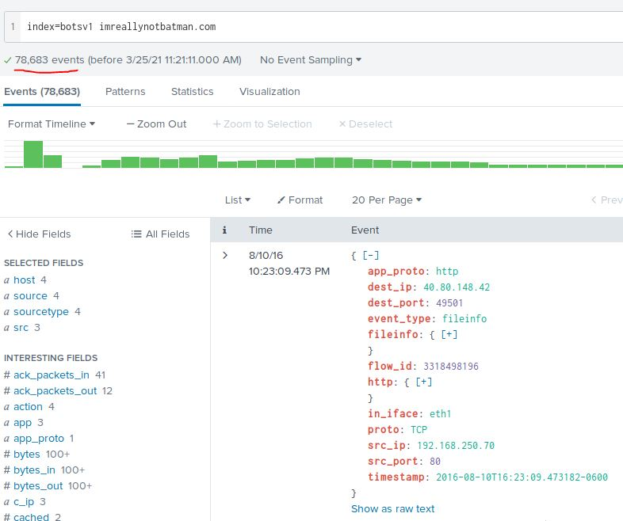

Something that is scanning our webserver is likely to be via HTTP, so lets set sourcetype to **stream:http**.

```
index=botsv1 imreallynotbatman.com sourcetype="stream:http"
```

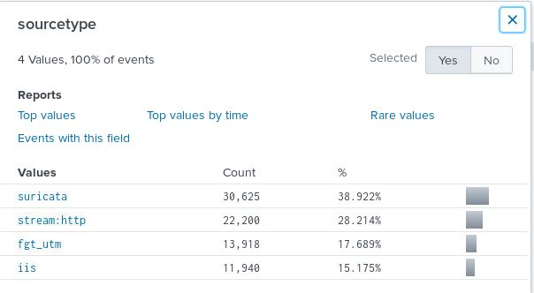

Lets see how many different ip addresses we are dealing with.

```
index=botsv1 imreallynotbatman.com sourcetype="stream:http" | stats count by src_ip
```

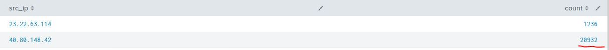

We can assume that due to the volume of traffic, this source ip is scanning our server.

> Answer: **40.80.148.42**

### Question 2
<b>"What web scanner scanned the server?"</b>

Looking at some of the traffic from 40.80.148.42, we can see it is running Acunetix - a vulnerability scanner.

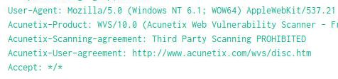

> Answer: **Acunetix**

### Question 3
<b>"What is the IP address of our web server?"</b>

The requests from 40.80.148.42 are targetting 192.168.250.70

```
index=botsv1 imreallynotbatman.com sourcetype="stream:http" src_ip="40.80.148.42" | stats count by dest_ip
```

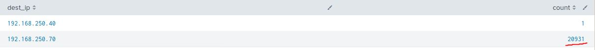

> Answer: **192.168.250.70**

### Question 4
<b>"What content management system is imreallynotbatman.com using?"</b>

Looking at the dest_headers we can see that Joomla is likely to be the CMS in use.

```
index=botsv1 imreallynotbatman.com sourcetype="stream:http" src_ip="40.80.148.42" dest_ip="192.168.250.70" | top limit=20 dest_headers
```

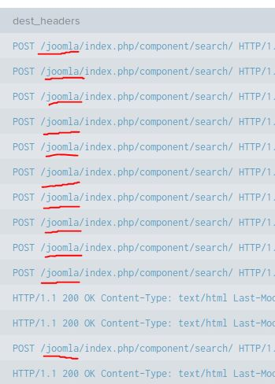

> Answer: **Joomla**

### Question 5
<b>"What address is performing the brute-forcing attack against our website?"</b>

A brute force attack is against some form of authentication. This will likely require GET/POST requests.

```
index=botsv1 imreallynotbatman.com sourcetype="stream:http" dest_ip="192.168.250.70" | stats count by http_method
```

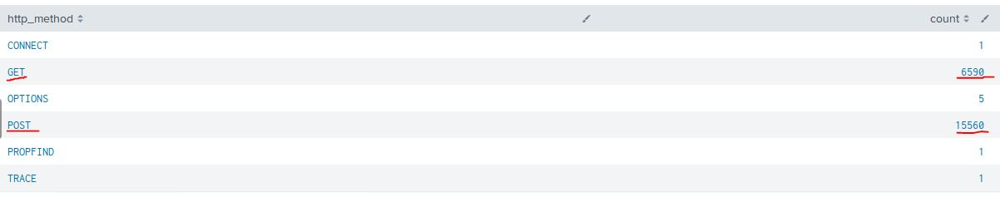

Looking at the http_content for a request shows that the password field is called **passwd**.

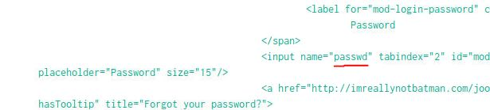

Refining our search further shows how many requests are coming from each ip.

```
index=botsv1 imreallynotbatman.com sourcetype="stream:http" dest_ip="192.168.250.70" http_method="POST" username passwd | stats count by src_ip
```

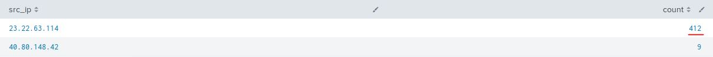

Listing **form_data** shows a brute force attempt on the **admin** user.

```
index=botsv1 imreallynotbatman.com sourcetype="stream:http" src_ip="23.22.63.114" dest_ip="192.168.250.70" http_method="POST" username passwd | top limit=20 form_data
```

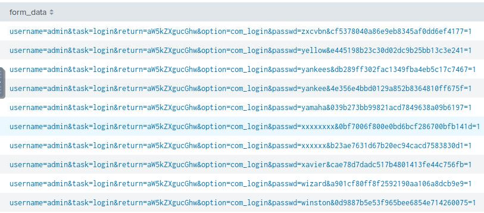

> Answer: **23.22.63.114**

### Question 6
<b>"What was the first password attempted in the attack?"</b>

The earliest entry will be at the **tail**.

```
index=botsv1 imreallynotbatman.com sourcetype="stream:http" src_ip="23.22.63.114" dest_ip="192.168.250.70" http_method="POST" username passwd | tail 1
```

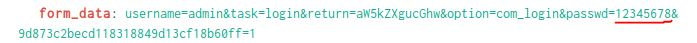

> Answer: **12345678**

### Quesion 7
<b>"One of the passwords in the brute force attack is James Brodsky's favorite Coldplay song. Which six character song is it?"</b>

This is an interesting query as we need to separate the passwords from the form_data.

```
index=botsv1 imreallynotbatman.com sourcetype="stream:http" src_ip="23.22.63.114" dest_ip="192.168.250.70" http_method="POST" username passwd 
| table form_data
| rex field=form_data "passwd=(?<passwd>\w+)" 
| table passwd 
| regex passwd= \w{6}
```

There is still 343 possibilities, sorting alphabetically reveals the answer.

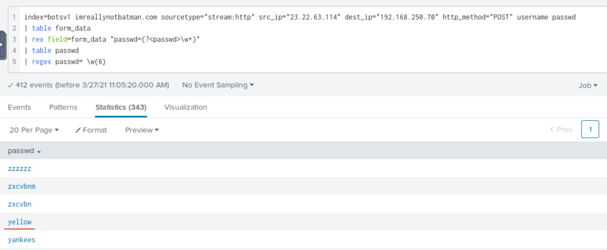

> Answer: **yellow**

### Question 8
<b>"What was the correct password for admin access to the content management system running imreallynotbatman.com?"</b>

```
index=botsv1 imreallynotbatman.com sourcetype="stream:http" dest_ip="192.168.250.70" http_method="POST" username passwd 
| rex field=form_data "passwd=(?<passwd>\w+)" 
| stats count by passwd
| where count>1
```

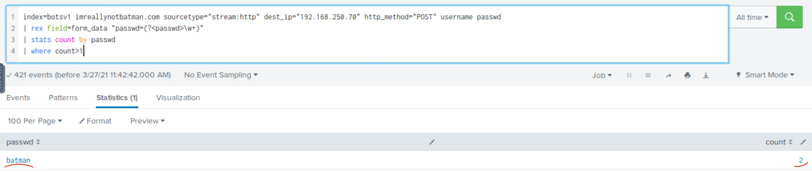

> Answer: **batman**

### Question 9
<b>"What was the average password length used in the password brute forcing attempt rounded to closest whole integer?"</b>

```
index=botsv1 imreallynotbatman.com sourcetype="stream:http" dest_ip="192.168.250.70" http_method="POST" username passwd 
| rex field=form_data "passwd=(?<passwd>\w+)" 
| eval length=len(passwd) 
| stats avg(length)
```

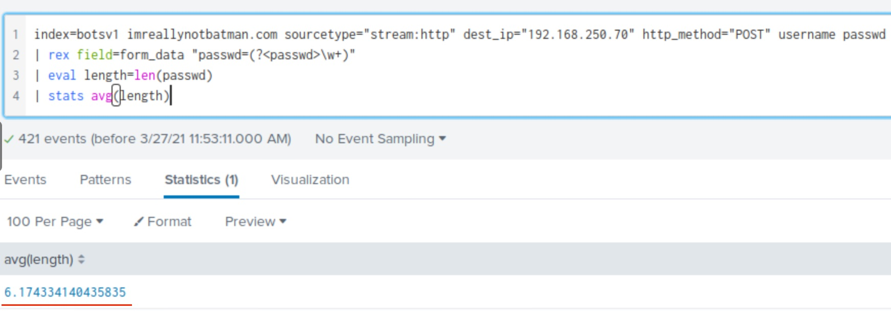

> Answer: **6**

### Question 10
<b>"How many seconds elapsed between the time the brute force password scan identified the correct password and the compromised login rounded to 2 decimal places?"</b>

```
index=botsv1 imreallynotbatman.com sourcetype="stream:http" dest_ip="192.168.250.70" http_method="POST" username passwd  | rex field=form_data "passwd=(?<passwd>\w+)"  | search passwd=batman 
| transaction passwd 
| eval dur=round(duration, 2)
| table dur
```

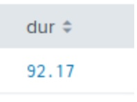

> Answer: **92.17**

### Question 11
<b>"How many unique passwords were attempted in the brute force attempt?"</b>

```
index=botsv1 imreallynotbatman.com sourcetype="stream:http" dest_ip="192.168.250.70" http_method="POST" username passwd 
| rex field=form_data "passwd=(?<passwd>\w+)" 
| stats count by passwd
```

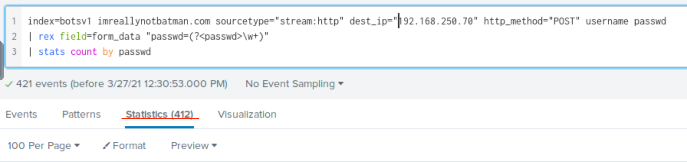

> Answer: **412**

### Question 12 
<b>"What is the name of the executable uploaded by P01s0n1vy?"</b>

```
index=botsv1 imreallynotbatman.com sourcetype="stream:http" dest_ip="192.168.250.70" form-data
```

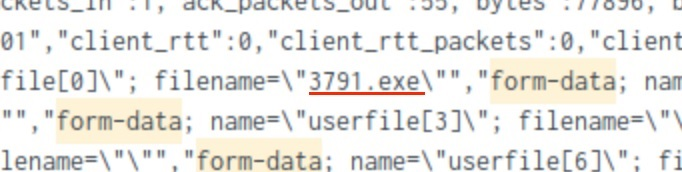

> Answer: **3791.exe**

### Question 13
<b>"What is the MD5 hash of the executable uploaded?"</b>

```
index=botsv1 3791.exe md5 sourcetype="XmlWinEventLog:Microsoft-Windows-Sysmon/Operational" CommandLine="3791.exe" 
| rex field="_raw" "MD5=(?<hash>\w+)" 
| table hash 
| stats count by hash
```

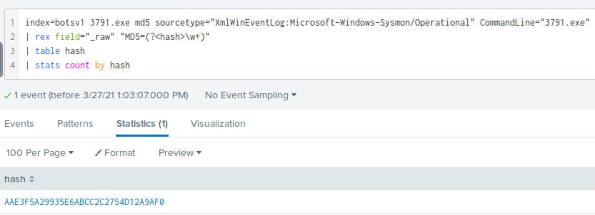

> Answer: **AAE3F5A29935E6ABCC2C2754D12A9AF0**

### Question 14
<b>"What is the name of the file that defaced the imreallynotbatman.com website?"</b>

```
index=botsv1 sourcetype="suricata" src_ip="192.168.250.70" dest_ip="23.22.63.114" 
|  stats count by http.http_method, http.hostname, http.url 
|  sort -count
```

> Answer: **poisonivy-is-coming-for-you-batman.jpeg**

### Question 15
<b>"This attack used dynamic DNS to resolve to the malicious IP. What fully qualified domain name (FQDN) is associated with this attack?"</b>

```
index=botsv1 sourcetype=fgt_utm "poisonivy-is-coming-for-you-batman.jpeg" 
| rex field="_raw" "hostname=(?<hostname>\w+)" 
| table hostname
```

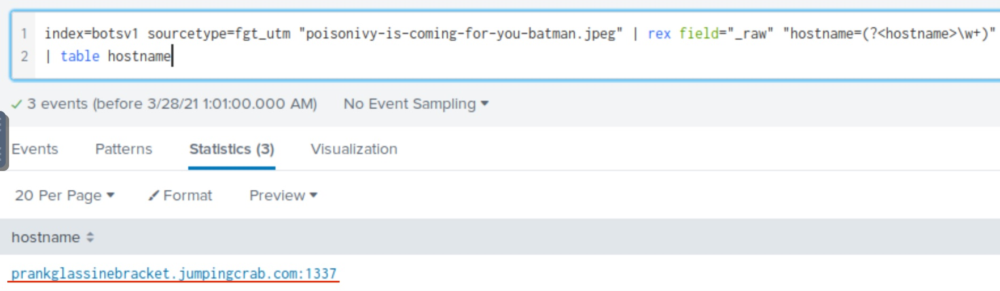

> Answer: **prankglassinebracket.jumpingcrab.com**

### Question 16 
<b>"What IP address has P01s0n1vy tied to domains that are pre-staged to attack Wayne Enterprises?"</b>

```
index=botsv1 sourcetype=fgt_utm "poisonivy-is-coming-for-you-batman.jpeg" 
| table dstip
```

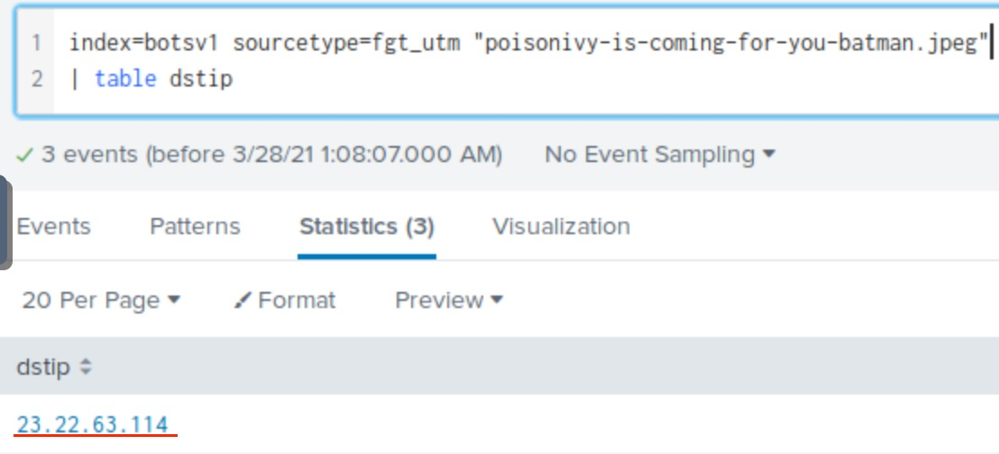

> Answer: **23.22.63.114**

### Question 17
<b>"Based on the data gathered from this attack and common open source intelligence sources for domain names, what is the email address that is most likely associated with P01s0n1vy APT group?"</b>

Doing a google search for **23.22.63.114** provdes the following page: https://www.threatcrowd.org/ip.php?ip=23.22.63.114.

On this page a diagram is provided which reveals a potential email address.

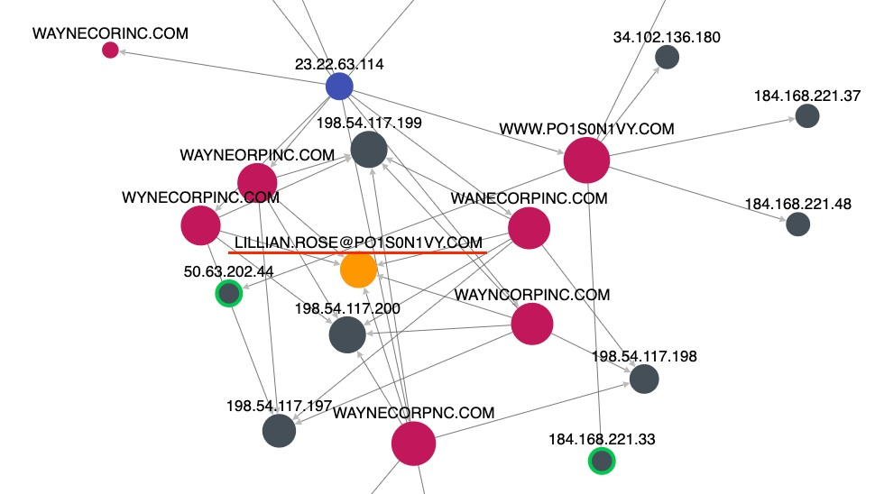

> Answer: **lilian.rose@po1s0n1vy.com**

### Question 18
<b>"GCPD reported that common TTPs (Tactics, Techniques, Procedures) for the P01s0n1vy APT group if initial compromise fails is to send a spear phishing email with custom malware attached to their intended target. This malware is usually connected to P01s0n1vy’s initial attack infrastructure. Using research techniques, provide the SHA256 hash of this malware."<b/>

Searching for **23.22.63.114 malware hash** provides a link to https://www.threatminer.org/host.php?q=23.22.63.114#gsc.tab=0&gsc.q=23.22.63.114&gsc.page=1.

This reveals a hash for a number of trojans.

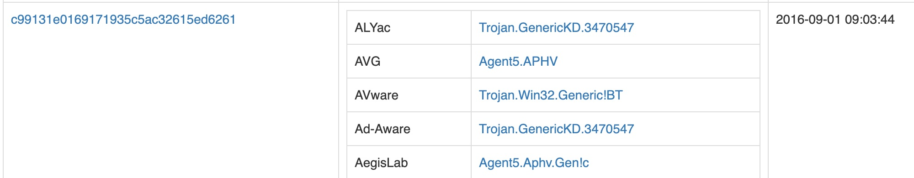

Following the link on the MD5 provides a SHA256 hash related to this malware - https://www.threatminer.org/sample.php?q=c99131e0169171935c5ac32615ed6261#gsc.tab=0&gsc.q=c99131e0169171935c5ac32615ed6261&gsc.page=1

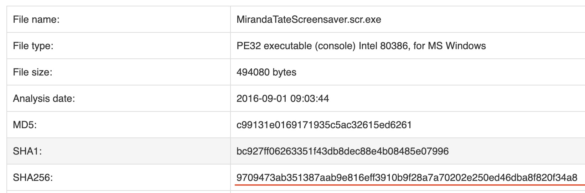

> Answer: **9709473ab351387aab9e816eff3910b9f28a7a70202e250ed46dba8f820f34a8**

### Question 19
<b>"What special hex code is associated with the customized malware discussed in the previous question?"</b>

Following the VirusTotal link on the previous page reveals the HEX code - https://www.virustotal.com/gui/file/9709473ab351387aab9e816eff3910b9f28a7a70202e250ed46dba8f820f34a8/community

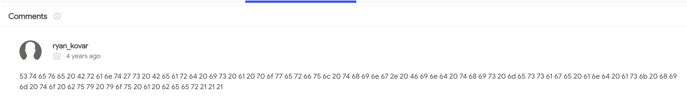

> Answer: **53 74 65 76 65 20 42 72 61 6e 74 27 73 20 42 65 61 72 64 20 69 73 20 61 20 70 6f 77 65 72 66 75 6c 20 74 68 69 6e 67 2e 20 46 69 6e 64 20 74 68 69 73 20 6d 65 73 73 61 67 65 20 61 6e 64 20 61 73 6b 20 68 69 6d 20 74 6f 20 62 75 79 20 79 6f 75 20 61 20 62 65 65 72 21 21 21**

### Question 20
<b>"What does this hex code decode to?"</b>

Putting the HEX code into an online converter (https://cryptii.com/pipes/hex-decoder) reveals the following message.

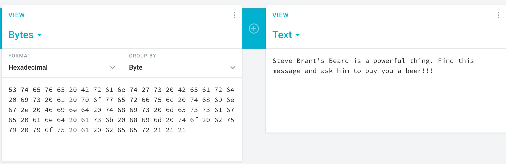

> Answer: **Steve Brant's Beard is a powerful thing. Find this message and ask him to buy you a beer!!!**

<hr>

## Scenario : Ransomware

### Question 21
<b>"What was the most likely IP address of we8105desk on 24AUG2016?"</b>

```
index=botsv1 host=we8105desk| top limit=20 src_ip
```

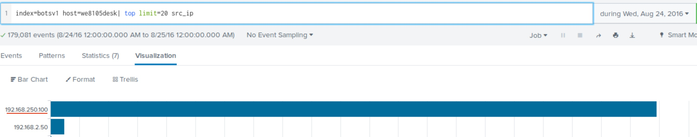

> Answer: **192.168.250.100**

### Question 22
<b>"What is the name of the USB key inserted by Bob Smith?"</b>

```
index=botsv1 host=we8105desk sourcetype=WinRegistry friendlyname 
| top limit=1 data
```

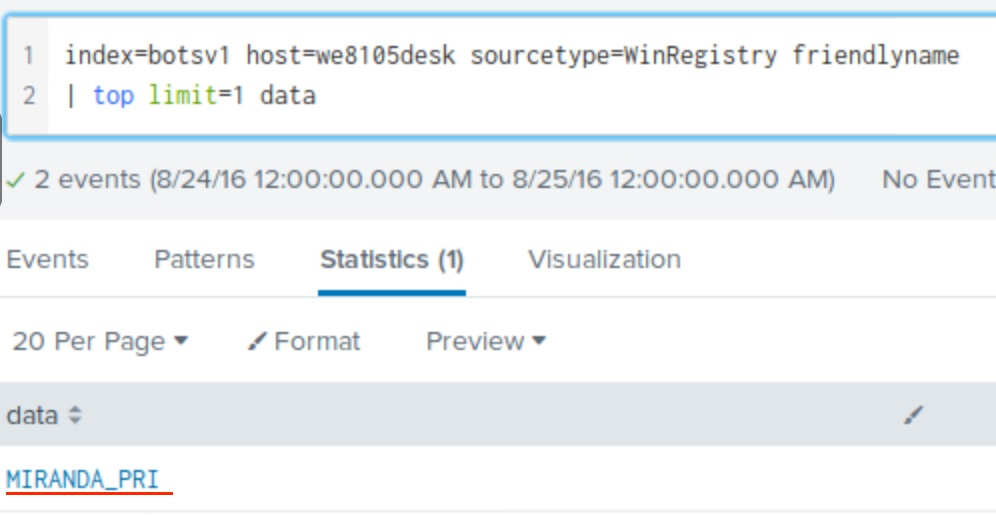

> Answer: **MIRANDA_PRI**

### Question 23
<b>"After the USB insertion, a file execution occurs that is the initial Cerber infection. This file execution creates two additional processes. What is the name of the file?"</b>

```
index=botsv1 host=we8105desk sourcetype="XmlWinEventLog:Microsoft-Windows-Sysmon/Operational" "d:\\" 
| reverse
```

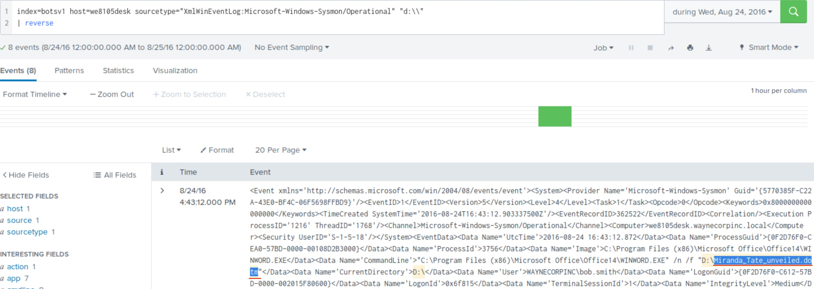

> Answer: **miranda_tate_unveiled.dotm**

### Question 24
<b>"During the initial Cerber infection a VB script is run. The entire script from this execution, pre-pended by the name of the launching .exe, can be found in a field in Splunk. What is the length in characters of this field?"</b>

```
index=botsv1 sourcetype="XmlWinEventLog:Microsoft-Windows-Sysmon/Operational" *.exe CommandLine=* EventCode=1
| eval length=len(CommandLine) 
| table CommandLine length 
| sort - 1 length
```

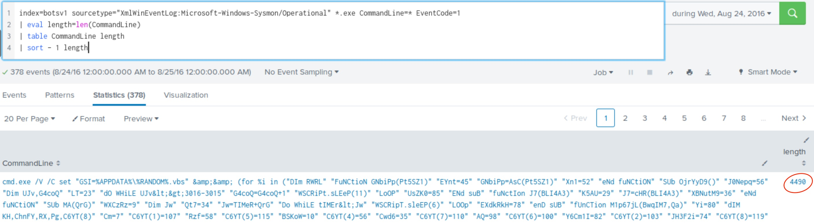

> Answer: **4490**

### Question 25
<b>"Bob Smith's workstation (we8105desk) was connected to a file server during the ransomware outbreak. What is the IP address of the file server?"</b>

```
index=botsv1 host="we8105desk" sourcetype="XmlWinEventLog:Microsoft-Windows-Sysmon/Operational" src="we8105desk.waynecorpinc.local" 
| stats count by dest_ip
```

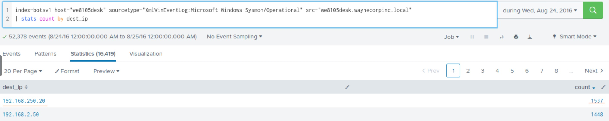

> Answer: **192.168.250.20**

### Question 26
<b>"What was the first suspicious domain visited by we8105desk on 24AUG2016?"</b>

```
index=botsv1 src="192.168.250.100" sourcetype="stream:dns" record_type=A NOT (query{}=*.microsoft.com OR query{}=*.bing.com OR query{}=wpad* OR query{}=isatap OR query{}=*.waynecorpinc.local OR query{}=*.windows.com OR query{}=*.msftncsi.com)
| table _time query{} src dest
| reverse
```

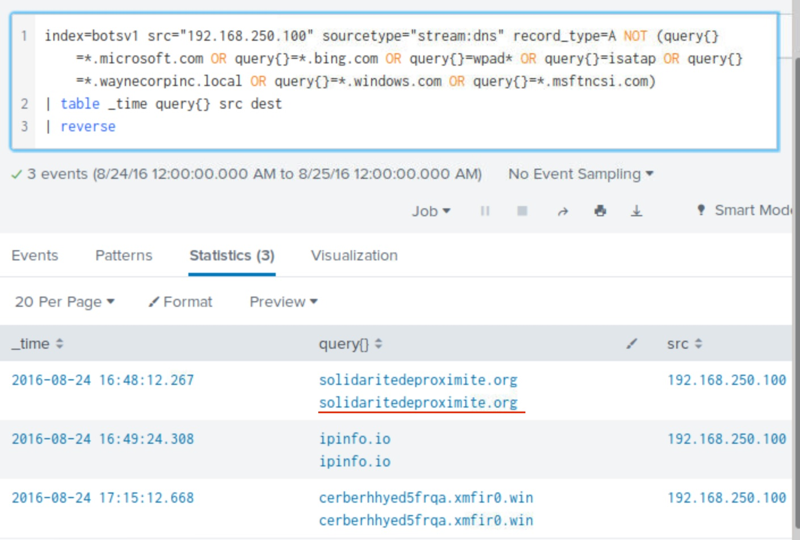

> Answer: **solidaritedeproximite.org**

### Question 27
<b>"The malware downloads a file that contains the Cerber ransomware cryptor code. What is the name of that file?"</b>

```
index=botsv1 src="192.168.250.100" sourcetype="suricata" url=*
| stats count values(url) by dest
```

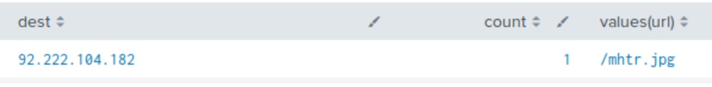

The first result is **mhtr.jpg**, doing a google search of this file reveals it is related to a ransomware  attack.

> Answer: **mhtr.jpg**

### Question 28
<b>"What is the parent process ID of 121214.tmp?"</b>

```
index=botsv1 sourcetype="XmlWinEventLog:Microsoft-Windows-Sysmon/Operational" 121214.tmp 
| table _time CommandLine ProcessId ParentProcessId ParentCommandLine 
| reverse
```

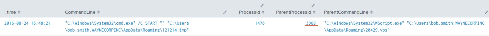

> Answer: **3968**

### Question 29
<b>"Amongst the Suricata signatures that detected the Cerber malware, which signature ID alerted the fewest number of times?"</b>

```
index=botsv1 sourcetype=suricata alert.signature=*cerber* 
| stats count by alert.signature_id
```

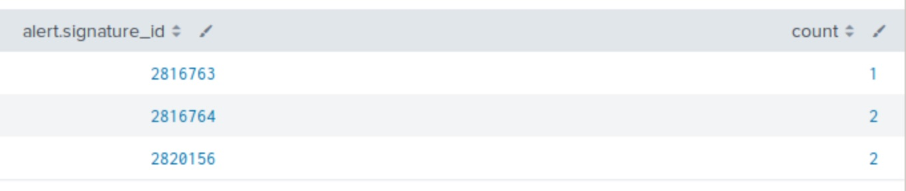

> Answer: **2816763**

### Question 30
<b>"The Cerber ransomware encrypts files located in Bob Smith's Windows profile. How many .txt files does it encrypt?"</b>

```
index=botsv1 sourcetype="XmlWinEventLog:Microsoft-Windows-Sysmon/Operational" host=we8105desk *.txt EventCode=2 TargetFilename="C:\\Users\\bob.smith.WAYNECORPINC\\*.txt" 
| stats dc(TargetFilename)
```

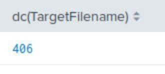

> Answer: **406**

### Question 31
<b>"How many distinct PDFs did the ransomware encrypt on the remote file server?"</b>

```
index=botsv1 sourcetype="*win*" pdf dest="we9041srv.waynecorpinc.local" Source_Address="192.168.250.100" 
| stats dc(Relative_Target_Name)
```

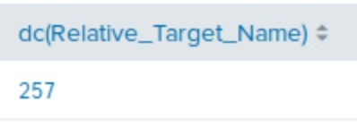

> Answer: **257**

### Question 32
<b>"What fully qualified domain name (FQDN) does the Cerber ransomware attempt to direct the user to at the end of its encryption phase?"</b>

```
index=botsv1 sourcetype="stream:DNS" src=192.168.250.100 record_type=A NOT (query{}=*.microsoft.com OR query{}=wpad OR query{}=isatap OR query{}=*.waynecorpinc.local OR query{}=*.bing.com OR query{}=*.windows.com OR query{}=*.msftncsi.com OR query{}=*.live.com) 
| table _time query{} src dest
```

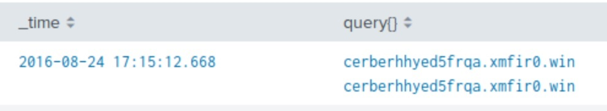

> Answer: **cerberhhyed5frqa.xmfir0.win**

### Recap

In this task we learnt how to:
 * Conduct search queries to find information in Splunk
 * Find identifiers of APT activity
 * Find identifiers of Ransomware activity
 * Conduct OSINT to find malware information

 
